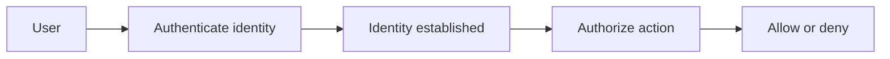
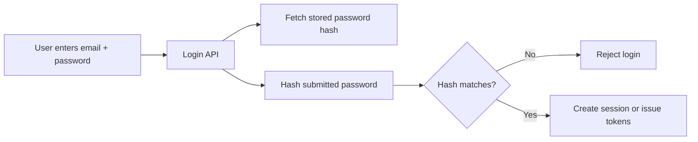
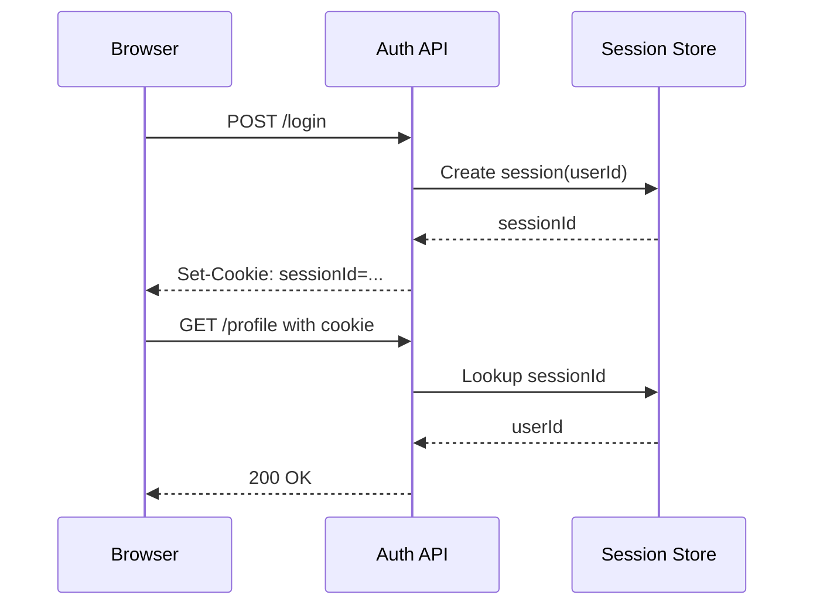
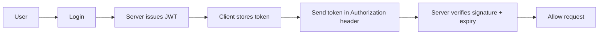
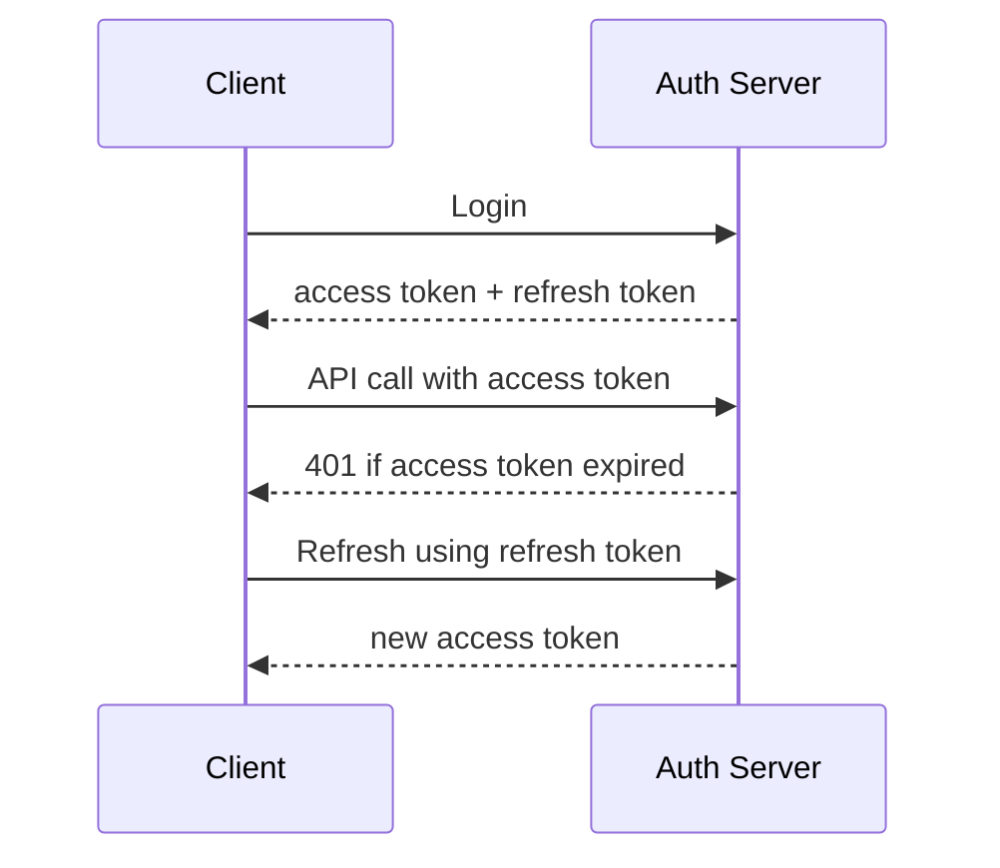
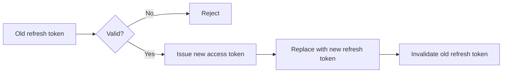
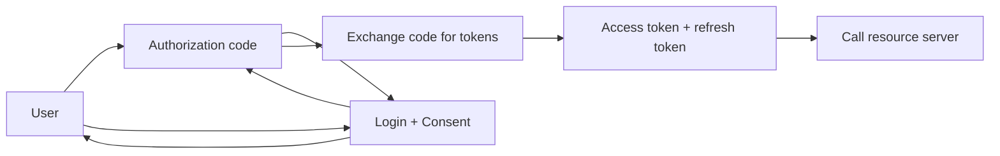
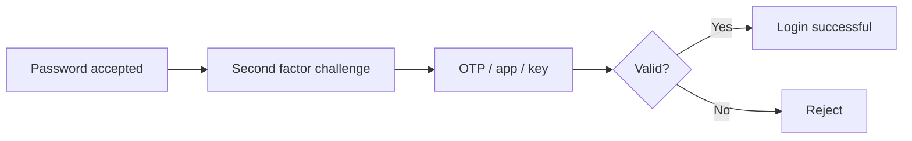

# Authentication Basics for SDE2 Backend

This note is for revision: what authentication is, how the common login flows work, and what to remember in interviews.

---

## 1. Authentication vs Authorization

**Authentication** answers: *Who are you?*  
**Authorization** answers: *What are you allowed to do?*

- Authentication happens first.
- Authorization happens after identity is known.
- Example: login with password = authentication, checking `admin` role = authorization.

---

## 2. Common Building Blocks

- **Credentials**: password, OTP, passkey, client secret, API key.
- **Session**: server-side record that says the user is logged in.
- **Token**: signed value that proves something about the user or client.
- **Claim**: data inside a token, like `userId`, `role`, `exp`.
- **Principal**: the identity being authenticated, usually a user or service.
- **Authentication factor**: something you know, have, or are.

### Authentication factors

- **Something you know**: password, PIN.
- **Something you have**: phone, authenticator app, hardware key.
- **Something you are**: fingerprint, face.

---

## 3. Password Login

The backend should never store raw passwords.

### What to store

- Store a **hashed** password.
- Use a slow hash such as **bcrypt**, **scrypt**, or **Argon2**.
- Use a unique **salt** per user.
- Optionally add a server-side **pepper**.

### Why hashing matters

- If the database leaks, the attacker should not get the original password.
- A fast hash like SHA-256 is not enough for password storage because it is easy to brute force.

### Login flow

### Interview points

- Passwords are verified by hashing the submitted password and comparing hashes.
- Salt makes each password hash unique even if two users have the same password.
- Pepper is kept outside the database, usually in config or a secret manager.

---

## 4. Session-Based Authentication

In session auth, the server keeps login state.

- User logs in.
- Server creates a session record.
- Server sends a session id in a cookie.
- Browser sends the cookie automatically on later requests.

### Why teams use it

- Easy to revoke.
- Easy to invalidate on logout.
- Good fit for browser-based apps.

### Flow

### Pros

- Easy logout
- Central control
- Good for browser apps

### Cons

- Needs shared session storage if you scale horizontally
- Browser cookie security must be handled carefully

---

## 5. Cookies

A cookie is a small piece of data stored by the browser and sent automatically to the same domain.

### Important cookie flags

- **HttpOnly**: JavaScript cannot read the cookie.
- **Secure**: only send over HTTPS.
- **SameSite**: helps reduce CSRF.
- **Domain** and **Path**: scope where the cookie is sent.

### Why HttpOnly matters

- Protects the session cookie from being stolen by XSS directly from `document.cookie`.

### Why SameSite matters

- Reduces the chance that another site can trick the browser into sending your cookie.

---

## 6. JWT Authentication

JWT = JSON Web Token.

A JWT is usually used as a **stateless access token**.

### What is inside a JWT

- **Header**: algorithm info
- **Payload**: claims like user id, role, expiry
- **Signature**: prevents tampering

### JWT flow

### Why JWT is useful

- Server does not need to store session state for every request.
- Works well for mobile apps, SPAs, and service-to-service APIs.

### JWT tradeoffs

- Harder to revoke immediately unless you keep a blacklist or short expiry.
- Token leakage is dangerous until it expires.
- Never put sensitive data in the payload; JWT payload is only encoded, not encrypted.

### Interview points

- JWT is signed, not encrypted.
- Signature proves the token was issued by a trusted server and was not modified.
- Expiry is mandatory in practice.

---

## 7. Access Token vs Refresh Token

This is one of the most important backend auth patterns.

- **Access token**: short-lived token used on every API call.
- **Refresh token**: longer-lived token used only to get a new access token.

### Why split them

- Access token can be short and safer.
- Refresh token reduces how often the user must log in again.

### Refresh flow

### Best practice

- Keep access token expiry short.
- Store refresh tokens securely.
- Rotate refresh tokens on every refresh if possible.
- Revoke refresh token on logout or suspicious activity.

### Refresh token rotation

---

## 8. Session Cookie vs JWT

| Aspect | Session Cookie | JWT |
|---|---|---|
| State | Server-side | Mostly stateless |
| Revocation | Easy | Harder |
| Browser support | Excellent | Good |
| Mobile/API support | Possible | Very common |
| Scaling | Needs shared session store | Easier to scale horizontally |

### Rule of thumb

- Use **session cookies** for browser-first web apps.
- Use **JWT access + refresh tokens** for APIs, mobile apps, and distributed systems.

---

## 9. OAuth 2.0

OAuth is about **delegated access**.

It answers:
- How can a user allow one app to access data from another app without sharing a password?

### Roles

- **Resource Owner**: the user
- **Client**: the app requesting access
- **Authorization Server**: issues tokens
- **Resource Server**: the API that holds data

### Authorization code flow

### Why OAuth is not login by itself

- OAuth is for authorization.
- Login is usually handled by **OpenID Connect**, which sits on top of OAuth.

---

## 10. OpenID Connect

OIDC = identity layer on top of OAuth 2.0.

- OAuth tells you what the client can access.
- OIDC tells you who the user is.
- OIDC adds the **ID token**.

### Interview line

- OAuth = delegated authorization
- OIDC = authentication and identity

---

## 11. JWT vs OAuth 2.0 - Interview Questions

These two get confused a lot in interviews.

### 1. Is JWT the same as OAuth 2.0?

No.

- **JWT** is a token format.
- **OAuth 2.0** is an authorization framework.

You can use JWT inside OAuth, but they are not the same thing.

### 2. What problem does JWT solve?

JWT is a compact way to carry claims between client and server.

- Often used as an access token.
- Useful when you want stateless authentication on the API side.
- The server can verify the signature without storing session state for every request.

### 3. What problem does OAuth 2.0 solve?

OAuth lets one app access another app's resources without giving away the user's password.

- It is about delegated authorization.
- It defines flows for getting tokens after user consent.

### 4. Can OAuth work without JWT?

Yes.

OAuth does not require JWT.
- The access token can be opaque.
- The token may be a random string that only the authorization server understands.

### 5. Can JWT be used without OAuth?

Yes.

- A service can issue JWTs after login.
- Many custom auth systems use JWTs without implementing OAuth.

### 6. Which one is better for login?

It depends on the system.

- For browser login with server-side state, sessions are often simplest.
- For APIs and distributed systems, JWT access tokens are common.
- For third-party delegated access, OAuth is the right model.

### 7. What is the difference between authentication and authorization here?

- **Authentication** = who the user is
- **Authorization** = what access the app gets

OAuth is mainly about authorization.
OIDC is what you use when you also want login / identity.

### 8. What is the difference between access token and JWT?

They are not the same category.

- **Access token** = token used to call an API
- **JWT** = one possible format for that token

An access token can be JWT or opaque.

### 9. Why are refresh tokens used?

Because access tokens are kept short-lived for security.

- Access token expires quickly.
- Refresh token is used to get a new access token.
- This limits damage if an access token leaks.

### 10. Common one-line answer in interviews

- JWT is a token format often used for stateless auth.
- OAuth 2.0 is a delegated authorization framework.
- OIDC is the login/identity layer built on top of OAuth 2.0.

---

## 12. MFA

MFA = Multi-Factor Authentication.

Examples:
- password + OTP
- password + authenticator app
- password + security key

### Why it matters

- A stolen password alone should not be enough to log in.

### Typical flow

---

## 13. API Keys and Service Accounts

API keys are common for machine-to-machine access.

- Simple to issue.
- Easy to identify the caller.
- Usually tied to a service account or project.

### Risks

- If leaked, they can be abused directly.
- Often less rich than OAuth tokens because they do not model user consent well.

### Use cases

- internal services
- third-party integrations
- simple developer APIs

---

## 14. CSRF and XSS in Auth

These are common auth interview topics.

### CSRF

- Attacker tricks the browser into sending an authenticated request.
- Mostly a concern when auth is stored in cookies.

### Defenses

- `SameSite` cookies
- CSRF token
- Origin / Referer checks for sensitive actions

### XSS

- Attacker injects script into your page.
- Script may steal tokens or perform actions as the user.

### Defenses

- output encoding
- input validation
- Content Security Policy
- `HttpOnly` cookies for session tokens

---

## 15. Logout and Revocation

What logout means depends on the auth model.

- **Session auth**: delete the session from the store.
- **JWT auth**: let access token expire, revoke refresh token, or maintain a deny list.
- **OAuth**: revoke refresh token and clear local session if present.

### Interview point

- Logout is easy with sessions.
- Logout is harder with stateless JWTs.

---

## 16. Security Checklist

- Hash passwords with bcrypt / Argon2 / scrypt.
- Never store plaintext passwords.
- Use HTTPS everywhere.
- Set cookies with `HttpOnly`, `Secure`, `SameSite`.
- Keep access tokens short-lived.
- Rotate refresh tokens.
- Do not put secrets in JWT payloads.
- Use MFA for sensitive accounts.
- Log auth events carefully, but avoid leaking secrets in logs.

---

## 17. Revision Summary

If you only remember a few things:

1. Authentication = identity, authorization = permission.
2. Passwords must be hashed, salted, and stored securely.
3. Session cookies are stateful and easy to revoke.
4. JWT access tokens are stateless but harder to revoke.
5. Refresh tokens are used to get new access tokens.
6. OAuth is delegated access; OIDC is login / identity.
7. MFA adds a second barrier after password.
8. CSRF matters most for cookie-based auth.
9. XSS matters for every auth system.
