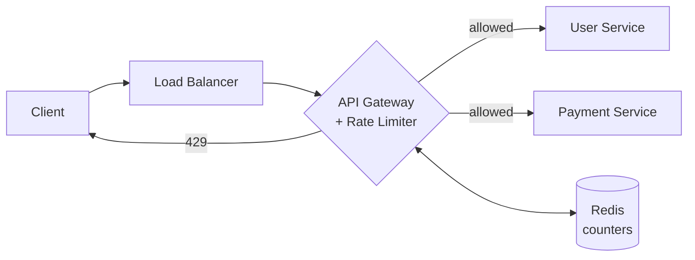
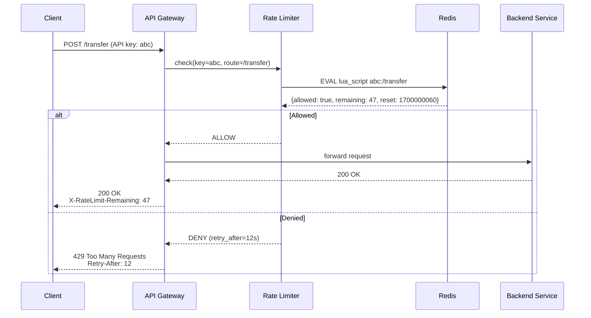

# HLD — Distributed Rate Limiter

> **Related:** [[LLD_06_Rate_Limiter]] covers the four algorithms (Token Bucket, Leaky Bucket, Fixed/Sliding Window) at the class level. This doc focuses on the **distributed system** around them — where the limiter lives, how it stays accurate across nodes, and how it survives Redis going down.

---

## 1. Why Rate Limit?

| Reason | Example |
|---|---|
| **Prevent abuse** | Login brute force, scraping |
| **Cost control** | Each backend call costs CPU / $$ |
| **Fairness** | Free tier vs paid tier quotas |
| **Protect downstream** | DB / 3rd-party API has lower throughput |
| **DDoS mitigation** | Drop traffic at the edge |

Rate limiting is **not** the same as throttling (slow down) or load shedding (drop based on system health). It enforces a **declared policy**: "100 req/min per user."


---

## 2. Requirements

### Functional
- Limit requests per **identity** (user_id, API key, IP, tenant)
- Different limits per **endpoint** (POST /transfer vs GET /profile)
- Support multiple **rules** simultaneously (per-second + per-day quota)
- Return HTTP **429 Too Many Requests** with `Retry-After` header
- Allow **burst** capacity (real users are bursty)

### Non-Functional
| Property | Target |
|---|---|
| Latency overhead | < 10 ms p99 |
| Availability | 99.99% (limiter going down ≠ API going down) |
| Accuracy | ±1% over the window (perfect is impossible at scale) |
| Throughput | 100K+ decisions / second per node |
| Scale | Works at 1 region or 10 regions |

The interesting tension: **accuracy vs latency**. Strong global consistency requires every node to consult one source of truth → kills latency. Loose local counting → drift between nodes.

---

## 3. Capacity Estimation

Assume Stripe-scale API:
- 10M MAU, average 500 API calls/day → **5B calls/day ≈ 58K RPS** average
- Peak (3× burst) → **175K RPS**
- 100 API gateway nodes → **~1750 RPS per node**

Storage for counters:
- Active users in any 1-min window: ~1M
- Counter size: `(user_id:8B) + (count:8B) + (window:8B) + overhead ≈ 50B`
- Total: **50 MB hot data** → fits comfortably in Redis on one node

Network to Redis:
- 1 GET + 1 INCR per request = 2 round trips
- At 175K RPS → 350K Redis ops/sec → **needs Redis Cluster or pipelining**

These numbers drive the design. Write them on the whiteboard first.

---

## 4. Where Does the Rate Limiter Live?

This is the **first big architectural choice** in the interview.

![[placement.excalidraw]]



### Four placement options

| Placement | Pros | Cons | Use when |
|---|---|---|---|
| **At Load Balancer** (NGINX, Envoy) | Fastest, drops before any app code runs | Limited rule expressiveness; hard to read user identity | Edge / DDoS protection |
| **API Gateway** (Kong, AWS API GW, custom) | Central policy, sees auth context | Single ingress = central bottleneck | **Most common — default choice** |
| **Sidecar** (Envoy proxy per pod) | Service mesh integration, language-agnostic | Distributed config management harder | Microservice mesh (Istio) |
| **In-process middleware** (Express/Spring filter) | Zero hop, simplest | Limits are per-instance unless they share state | Single-service apps, internal APIs |

> **Default answer in interview:** API Gateway tier, with Redis as shared state. Mention the sidecar/edge variants when asked about scale or DDoS.

---

## 5. Algorithm Choice (Quick Recap)

Full derivations live in [[LLD_06_Rate_Limiter]]. Summary for system-level choice:

| Algorithm | Memory / user | Burst-friendly | Accuracy | Best for |
|---|---|---|---|---|
| **Fixed Window Counter** | O(1) | ❌ (edge bursts) | Loose | Coarse quotas (daily limit) |
| **Sliding Window Log** | O(N) requests | ✅ | Exact | Low-traffic, high-value APIs |
| **Sliding Window Counter** | O(1) | ✅ | ~99% | **Default for HTTP APIs** |
| **Token Bucket** | O(1) | ✅✅ (configurable burst) | Exact | Steady throughput w/ bursts |
| **Leaky Bucket** | O(1) | ❌ (smooths) | Exact | Outbound calls to slow downstream |

**Cloudflare uses sliding window counter with 10s buckets.** **Stripe uses token bucket per API key.** Mention these — interviewers like real precedent.

---

## 6. Data Flow — The Critical Path

![[flow.excalidraw]]



### Why a **Lua script**, not GET + INCR?

```lua
-- atomic_check_and_increment.lua
local current = redis.call('GET', KEYS[1]) or 0
if tonumber(current) >= tonumber(ARGV[1]) then
    return {0, current}  -- denied
end
redis.call('INCR', KEYS[1])
redis.call('EXPIRE', KEYS[1], ARGV[2])
return {1, current + 1}  -- allowed
```

GET + INCR over the network is **two round trips** and races: 10 nodes can all read `current=99`, all decide "below limit," all increment → 109. A Lua script runs atomically inside Redis — single round trip, no race.

---

## 7. Storage Layer Deep Dive

### Option A — In-memory per node (no shared state)

Each gateway node tracks its own counters. If you have 10 nodes and the limit is 100/min, the **effective limit is 1000/min** in the worst case.

✅ Zero latency, no Redis dep
❌ Inaccurate — only OK if you can tolerate 10× drift

**When this is fine:** Internal APIs, sticky-session load balancing, soft limits.

### Option B — Centralized Redis (default)

Single Redis instance (or primary-replica) holds all counters. Every gateway node consults it.

✅ Strong accuracy, simple
❌ Redis is now a critical dependency. **Latency = network RTT to Redis (1-3ms within DC).**

**Failure mode:** If Redis dies, do you fail open (allow everything → DDoS risk) or fail closed (block everything → outage)? **Default: fail open with circuit breaker** — rate limiting is a protection, not a hard requirement for correctness.

### Option C — Redis Cluster (sharded)

Shard by `user_id` (consistent hashing). Each user's counters live on one shard.

✅ Scales horizontally
❌ Hot-key problem if one user/key gets disproportionate traffic (e.g., `anonymous_ip`)

**Mitigation for hot keys:** Local cache with short TTL (1s) + write-back to Redis. Accept slight drift for one bad actor.

### Option D — Two-tier (Local + Redis)

Each node keeps a **local approximate counter** synced asynchronously with Redis.

```
Local counter: increments instantly, allows decisions in <1ms
Background flush: every 100ms, push local delta to Redis, pull current global value
```

✅ Sub-ms latency, Redis handles 10× less load
❌ Drift window = flush interval × node count

**This is what Cloudflare does at the edge.** Mention it for the "scale to 10M RPS" follow-up.

---

## 8. The Distributed Synchronization Problem

This is where most candidates fumble. Be precise.

### Problem
Limit: 100 req/min per user. User hits 10 different gateway nodes simultaneously.

### Naive solution
Each node checks Redis on every request → 100% accurate, but Redis becomes the bottleneck.

### Realistic solutions

| Strategy | Accuracy | Latency | Complexity |
|---|---|---|---|
| **Sticky sessions** (LB routes user to same node) | High | Low | Low — but LB must support it |
| **Centralized Redis + Lua** | Exact | 1-3 ms | Medium |
| **Local + async flush** | ~95% (drift) | <1 ms | High |
| **Gossip protocol** (nodes broadcast counts) | ~90% | <1 ms | Very high |

**Interview tip:** Start with centralized Redis. When pushed on scale, evolve to two-tier. Only mention gossip if asked about region-spanning systems.

---

## 9. Multi-Region Rate Limiting

The hardest variant. Same user calls APIs in US and EU regions.

![[multi-region.excalidraw]]

### Three approaches

**1. Per-region limits (easiest)**
"100 req/min per region" → user could effectively get 200/min globally. Acceptable for soft quotas.

**2. Global Redis with cross-region replication**
- Active-passive: writes to primary region, replicas read-only.
- Latency: 50-100ms cross-region → kills the critical path.

**3. CRDT-based counters (e.g., Redis Enterprise CRDB, DynamoDB Global Tables)**
- Each region writes locally, replicates async.
- Eventual consistency — counts converge.
- User might burst slightly over the limit during replication lag, but within tolerance.

**Real-world:** Stripe and GitHub run per-region limits. Cloudflare uses eventual consistency via their Quicksilver KV store.

---

## 10. Failure Handling

### Redis goes down
| Strategy | Behavior | Risk |
|---|---|---|
| **Fail open** | Allow all requests | Brief vulnerability to abuse |
| **Fail closed** | Reject all requests | Full outage |
| **Fall back to local** | Each node uses in-memory limits | Loose accuracy but service stays up |

> **Default: fail open with circuit breaker + alerting.** Rate limits protect against abuse, not correctness — losing them temporarily is far better than taking the API down.

### Clock skew across nodes
Use **Redis server time** (`TIME` command) as the canonical clock for window boundaries. Never trust application-server clocks for sliding windows.

### Hot keys
- Sharded counters: `user:abc:shard:{0..9}` — round-robin across shards, sum on read.
- Trades accuracy for throughput.

---

## 11. API Contract

### Request — gateway internal (RPC or library call)
```json
{
  "identity": "api_key:sk_live_abc123",
  "resource": "POST /v1/transfers",
  "cost": 1
}
```

### Response
```json
{
  "allowed": true,
  "limit": 100,
  "remaining": 47,
  "reset_at": 1700000060,
  "retry_after_seconds": null
}
```

### Public-facing (when denied)
```http
HTTP/1.1 429 Too Many Requests
X-RateLimit-Limit: 100
X-RateLimit-Remaining: 0
X-RateLimit-Reset: 1700000060
Retry-After: 12
Content-Type: application/json

{"error": "rate_limited", "message": "Too many requests. Retry in 12s."}
```

**Why expose these headers?** Lets well-behaved clients back off gracefully. **Stripe, GitHub, AWS** all expose these.

---

## 12. Real-World Reference Architectures

| Company | Layer | Algorithm | Storage | Notable |
|---|---|---|---|---|
| **Stripe** | API gateway | Token bucket per key | Redis | Per-endpoint costs (writes cost more than reads) |
| **GitHub** | App tier | Token bucket | Redis | 5000/hr authenticated, 60/hr anonymous |
| **Cloudflare** | Edge (workers) | Sliding window counter | Quicksilver KV | Eventually consistent, 200+ POPs |
| **AWS API Gateway** | Managed | Token bucket | DynamoDB | Per-method + per-stage limits |
| **Discord** | Microservice middleware | Token bucket | Redis | Per-route + per-user, exposed via headers |

---

## 13. Interview Drilldowns

The interviewer will pick one of these to go deep on. Prepare answers.

### Q1: "How do you scale to 10M RPS?"
- Move to two-tier (local + Redis flush every 100ms)
- Shard Redis by user_id
- Push limiting to the edge (CDN workers)
- Accept eventual consistency

### Q2: "User has 1 API key but hits 5 different microservices — how do they share the limit?"
- Centralize at API gateway, not per-service
- Or: use a shared rate-limiter service that all services call (sidecar pattern)

### Q3: "A user bursts 1000 requests in 1 second to a 100/min API. What happens?"
- Token bucket: first 100 allowed (bucket drained), rest get 429 until refill
- Sliding window log: exact — first 100 allowed, rest denied
- Fixed window: depends on window boundary — could allow 200 across the boundary

### Q4: "How do you do per-IP + per-user + per-endpoint at the same time?"
- Multiple rules evaluated in parallel; **deny if any rule denies**
- Cache decision per-rule to avoid N Redis calls per request
- Use Redis Lua to check multiple keys atomically

### Q5: "Redis is down for 30 seconds. Walk me through what happens."
- Circuit breaker opens after N failures
- Fall back to local counters (loose, per-node)
- Alert oncall
- When Redis recovers, do NOT replay — just resume; brief overcount is fine

### Q6: "Free tier vs paid tier?"
- Limits are config (DB-backed, hot-reloaded)
- Lookup tier at auth time, pass tier into rate limiter
- Cache tier in JWT to avoid extra DB call

### Q7: "How do you test this?"
- Unit: each algorithm with fake clock
- Integration: real Redis, simulate burst
- Load test: vegeta / locust, verify 429 kicks in at the right RPS
- Chaos: kill Redis, verify fail-open works

---

## 14. Common Gotchas

- **Counting denied requests:** Should a 429 count against the next bucket? Usually no — but document the choice.
- **Cost-weighted requests:** A POST to /transfer is "worth" 5 tokens, a GET is worth 1. Token bucket handles this naturally.
- **Pre-flight OPTIONS (CORS):** Usually exempt from limits.
- **Internal service-to-service:** Use service identity, not end-user identity. Different limits.
- **Replay-safe idempotency:** If client retries with same idempotency key, don't double-count.

---

## 15. Summary — The 5-Minute Whiteboard

If you have 5 minutes left in the interview:

1. **Algorithm:** Sliding window counter (default) or token bucket (if bursty)
2. **Placement:** API gateway tier
3. **Storage:** Redis with Lua script for atomicity
4. **Identity:** API key > user_id > IP (in that order)
5. **Response:** HTTP 429 + standard headers
6. **Failure:** Fail open with circuit breaker
7. **Scale:** Two-tier local cache → Redis cluster → CDN edge
8. **Multi-region:** Per-region limits unless strong consistency required

---

## Cross-References

- [[LLD_06_Rate_Limiter]] — algorithm implementations in Java
- [[10_heap_patterns|Top-K]] — for "most-rate-limited users" dashboard
- [[02_Concurrency_in_LLD]] — atomic operations, JMM (relevant for in-process limiters)
